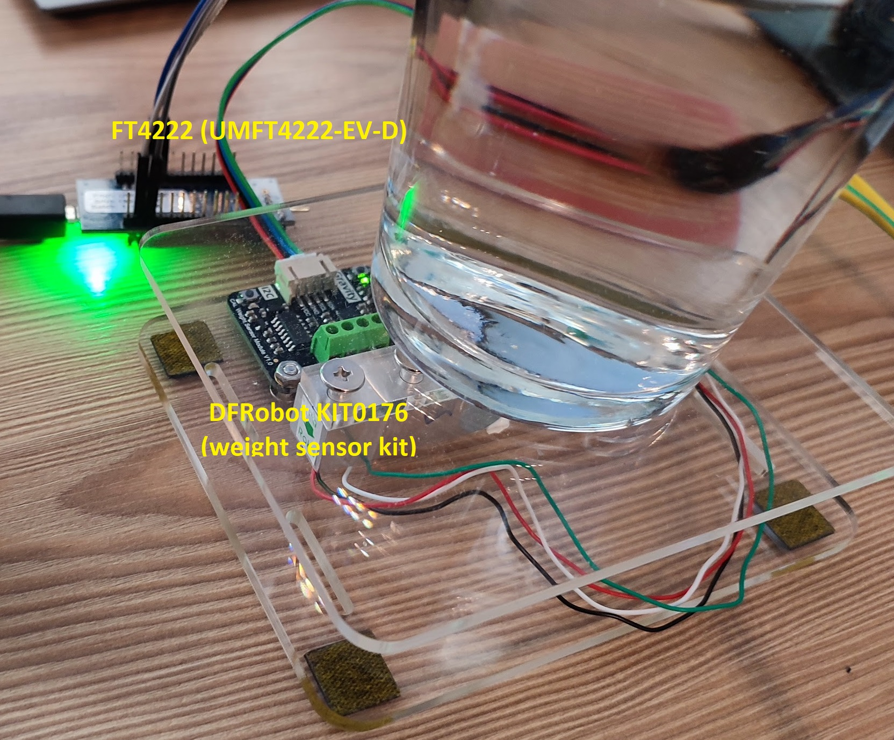
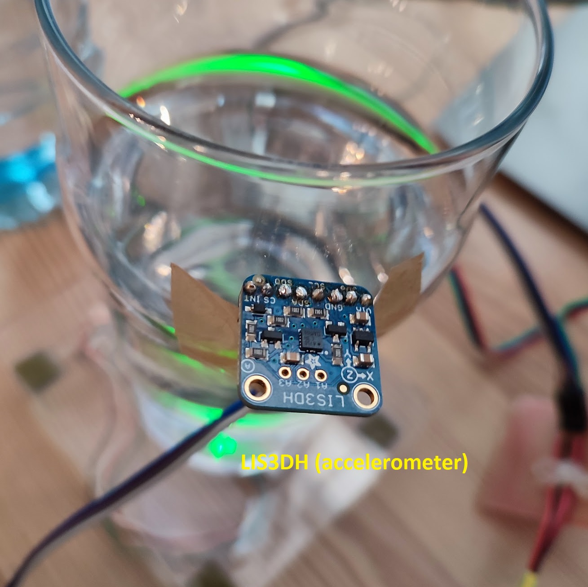

# Track your Water Consumption Using IoT with .NET

## Module Source Link

You can find the full workshop in the [.NET Conf Student Zone 2022 repository](https://github.com/microsoft/dotnetconf-studentzone/tree/main/Using%20IOT%20and%20.NET).

## Goals

In this workshop, we will discuss IoT with .NET.

| **Goal**              | Create an app to track your water consumption using IoT in .NET                                    |
| ----------------------------- | --------------------------------------------------------------------- |
| **What will you learn**       | IoT, .NET, C#                                        |
| **What you'll need**          | [.NET SDK](https://dotnet.microsoft.com/download/dotnet/6.0?WT.mc_id=academic-78652-leestott), [Visual Studio](https://visualstudio.microsoft.com/?WT.mc_id=academic-78652-leestott) |
| **Duration**                  | 1 hour                                                                |
| **Microsoft Cloud Topics taught**                  | Azure                                                                |
| **Just want to try the app or see the solution?** | [Solution](solution)                          |
| **Slides** | [Powerpoint](slides.pdf) 
                         
## Video

[Train the Trainer Video](https://aka.ms/studentzone-iot)

## Pre-Learning

[.NET IoT Learning Path](https://aka.ms/dotnetIOT)

## Prerequisites

- [.NET SDK](https://dotnet.microsoft.com/download/dotnet/6.0?WT.mc_id=academic-78652-leestott)
- [Visual Studio](https://visualstudio.microsoft.com/?WT.mc_id=academic-78652-leestott)

I2C devices require two lines (or cables or connections):
- SDA - data line, it may be sometimes called SDI
- SCL - clock line, it may be sometimes called SCK

on top of that each device needs power source:
- GND - ground - sometimes marked with minus sign
- VCC - voltage collector - it has higher voltage with respect to ground, typically it's 3.3 or 5V, it may be also marked as VIN (input voltage)

## What students will learn

Have you ever wanted to track the amount of water you drink each day? Let’s build prototype of smart bottle - we need to tell how much water was consumed Where do we start? We need a sensor and something to connect it to. For this workshop we will use .NET IoT!

*add a screenshot of the completed project*

 

## Milestone 1: Setup and connect your I2C IoT devices

## Milestone 2: Connect your IoT devices to your PC

## Milestone 3: Design the "smart water bottle"

## Milestone 4: Write the code to detect your water consumption!
   1. Read from the accelerometer and weight sensors
   2. Set up auto-detection to store the timestamp, weight, and acceleration anytime we drink, refill, or move our bottle

## Next steps

[.NET IoT Learning Path](https://aka.ms/dotnetIOT)

## Feedback

Be sure to give [feedback about this workshop](https://forms.office.com/r/MdhJWMZthR)!

[Code of Conduct](../CODE_OF_CONDUCT.md)

